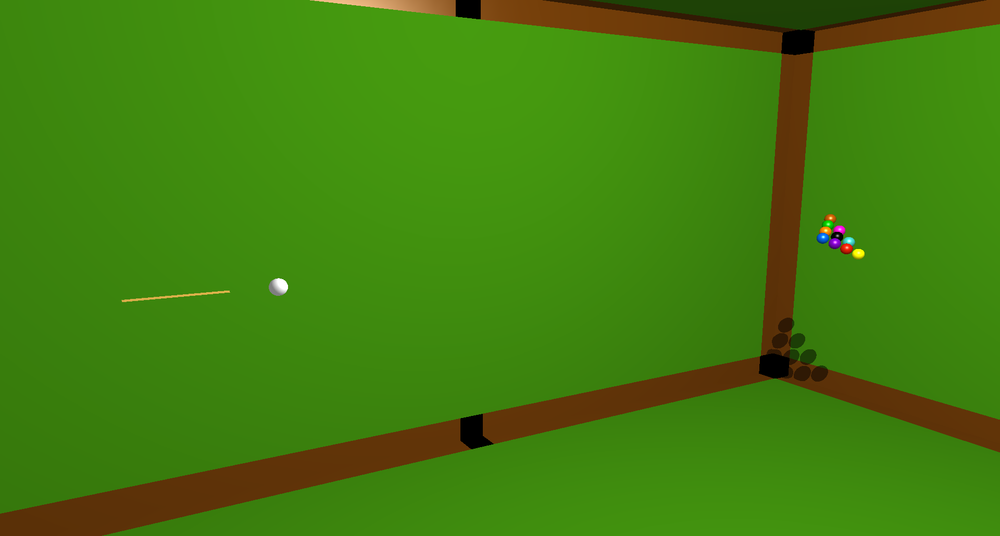

@title[Title Slide]

# 3DPool
## With AI
### by No Good Devs
**Casey Bigelow** | **Rishi Amarnani** | **Trey Gonsoulin**

---

@title[Introduction]

## What is Pool?

---

@title[Other Pool]
## No. The other pool.

@title[AI]

# AI Progress

+++

@title[Thought Process]

## How does our AI think?
 - Objective:
	- Pick a good ball and a pocket (shot)
 - What makes a shot good?
	- Which color balls
 	- Proximity to pockets
	- Angle of shot
 - Where to hit the ball

---

@title[Code Structure]

## Code Structure/Design:
 - Design Goals
 - Player class hierarchy
 - Component-based design

---

@title[Plans for the Future]

## Plans for the Future:
 - Faster to slower AI movement
 - Distance-based AI power
 - AI difficulty
	- Achieved by rotation offset
	- Multiple levels
	- Dynamic AI
 - UI Improvements

---

@title[Conclusion]

## Still not a swimming pool.

